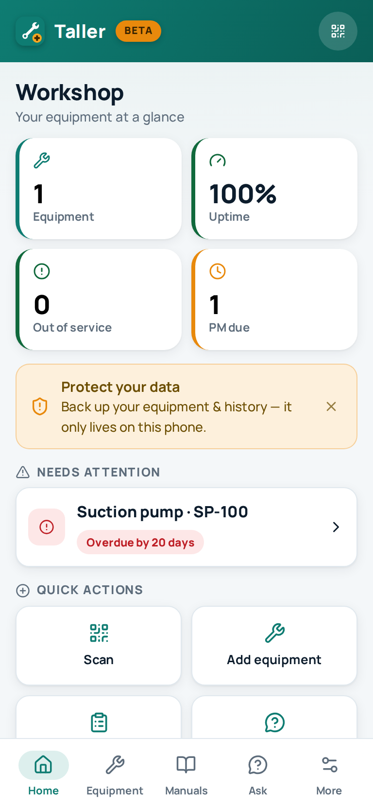
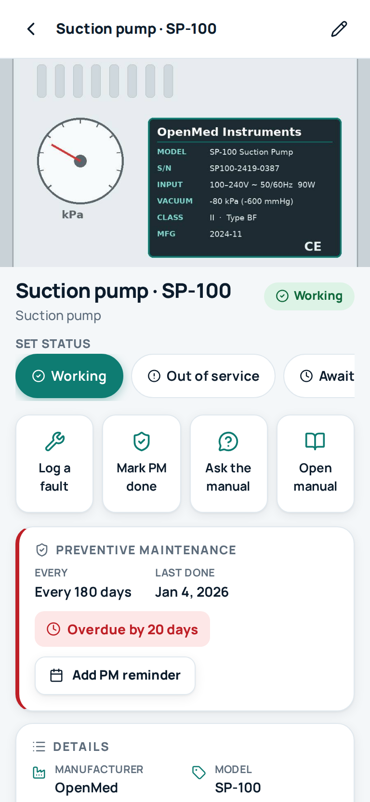
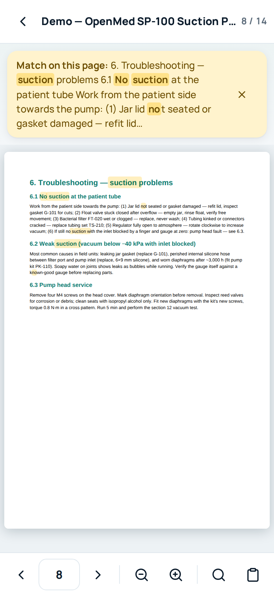
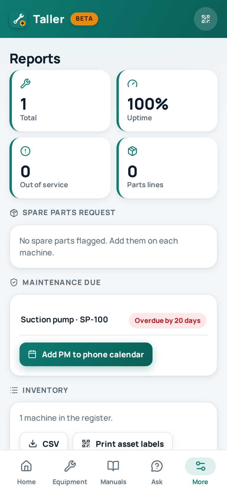

# 🔧 Taller — the offline workshop for biomedical technicians

**A free, open-source maintenance app for biomedical equipment technicians (BMETs) in low-resource hospitals.**

Keep a register of every machine you look after — with its status, maintenance schedule, spare parts and service history — right next to the **searchable service manuals** and a **grounded AI assistant** that answers only from those manuals. All offline, all on your phone, free forever.

<p align="center">
  
  
  
  
</p>

> **Status: BETA.** This version exists so real technicians can tell us whether it's worth building properly. Try it with one of your own manuals and use the in-app "60-second feedback" — brutal honesty welcome. If technicians say it helps, it gets built seriously. If not, we'll build something else that does.

## Why

In many hospitals, 38–40 % of medical equipment sits out of service — and a landmark study (Malkin & Keane 2010) found **72 % of broken equipment could be repaired with no imported parts** — what's missing is mostly *access to information*. Service manuals live scattered across PCs, WhatsApp chats and photocopies; workshop internet is intermittent; and the few great resources online (Frank's Hospital Workshop, iFixit's biomed library) need a connection. Taller puts the technician's own documentation in their pocket, working offline, free forever.

## What it does

- **🛠️ Equipment register** — one card per machine with WHO-style inventory fields (type, manufacturer, model, serial, asset tag, location, power, risk), a **photo of the nameplate/fault**, its status, and its full service history. Grounded in WHO's medical-equipment inventory guidance and the device set from national LMIC baselines.
- **📊 Dashboard** — at a glance: how many machines are up, what's out of service, what preventive maintenance is due or overdue, and how many spare parts are needed.
- **🗓️ Preventive maintenance** — risk-based PM schedules (life-support gear checked more often); the app flags what's due and overdue and records each PM in one tap. No server, no push needed — the workshop opens the app and sees what to do.
- **📦 Spare-parts request & reports** — flag the parts (with quantities) each machine is waiting for, then export a **fleet status report** and a **spare-parts procurement list** (CSV / printable / share) to hand to management — the paperwork that unlocks budget.
- **🏷️ QR asset tags** — print a QR label per machine, stick it on, and **scan it to open that machine's record + manual + history** on the spot (camera scan with a typed-code fallback; works offline).
- **⏱️ Downtime tracking** — status changes are timestamped, so a machine shows "out of service for 12 days" and reports rank the longest-down units — the number a manager needs.
- **🗓️ Maintenance reminders** — export upcoming PMs as a recurring **calendar file (.ics)** your phone reminds you about, with no server and no internet.
- **💾 Backup & restore** — your workshop data (equipment, photos, history) lives only on this phone; export a backup file to keep it safe, move to a new phone, or share with a colleague. The app reminds you when a backup is due.
- **📚 Service manuals** — import your own PDFs (they never leave your phone) and **search across all of them offline**, with matched terms **highlighted right on the PDF page**.
- **🔎 Find a manual you don't have** — the most-cited pain for a technician is not having the manual at all. One tap opens the free public manual libraries (iFixit Biomedical, Frank's Hospital Workshop, MedWrench), pre-filled with the machine's make and model, so an empty shelf isn't a dead end. Taller only links out — it hosts nothing.
- **💬 Ask your manuals** — describe a fault; get the best-matching manual passages with page numbers. With internet (optional), an AI answers *grounded only in those excerpts*, citing pages — it refuses to invent. One tap also copies a ready-made grounded prompt for ChatGPT/any AI. From any machine, "Ask the manual" is pre-scoped to its manual.
- **📷 Scanned manuals** — detected automatically; optional on-device OCR makes them searchable.
- **🌍 English · Français · Español · Português** — full UI (incl. ~28 localized equipment types) plus demo manuals in EN and FR.
- **🖥️ Desktop-friendly** — open the link on a workshop PC and scan the QR code to move it to your phone.

## Principles (non-negotiable)

- Free forever. No ads. No accounts. No patient data. No tracking of any kind.
- Offline-first: designed for a 2–4 GB RAM Android phone and a workshop with bad internet (~2 MB first load, then fully offline).
- Grounded answers only: every answer cites the manual page; when the manuals don't contain the answer, it says so.
- Your files stay yours: manuals are stored only on your device. The optional AI mode sends only the few excerpts needed to answer a question, and stores nothing.
- Open source under Apache-2.0. Clean-room: no copied code or copyrighted content — the demo manual is an original, fictional document.

## Use it

It's a web app (PWA): **open the link, add a manual, done.** Install it from Chrome's menu ("Add to Home screen") for full offline use. If you open it inside WhatsApp's browser, tap ⋮ → *Open in Chrome* first.

Hosting your own copy: any static host works. Fork → GitHub Pages → done.

## Optional AI backend

The app is fully functional without any server. To enable live AI answers, deploy the single-file Cloudflare Worker in [`worker/ai-worker.js`](worker/ai-worker.js) (free tier, ~15 min, instructions inside the file) and put its URL in `js/config.js → aiEndpoint`. It calls Claude with strict grounding instructions, per-IP daily limits, and stores nothing.

## Safety

Taller is an information tool for professionals. It is not a substitute for manufacturer documentation, training, or local regulations. Always verify the cited page before acting; follow electrical-safety procedures; never bypass safety interlocks or alarms.

## Tech

Vanilla JS PWA, no build step, ~450 KB gzipped app + data engines. [pdf.js](https://mozilla.github.io/pdf.js/) (Apache-2.0) for rendering/extraction, [MiniSearch](https://github.com/lucaong/minisearch) (MIT) for on-device full-text search, [tesseract.js](https://tesseract.projectnaptha.com/) (Apache-2.0) for optional OCR, [Lucide](https://lucide.dev) icons (ISC), [Manrope](https://github.com/sharanda/manrope) type (OFL). IndexedDB stores everything (equipment, manuals, page text, photos, logs); a service worker makes it fully offline; photos are compressed on-device to ~1280 px. Everything vendored — no CDNs at runtime.

```
index.html  css/  js/        — the app (no build step: edit and reload)
  js/home,equipment,reports   — the CMMS layer (register, dashboard, PM, parts)
  js/backup,qr,scan            — backup/restore, QR labels, camera scanner
  js/library,reader,ask,search — manuals + grounded assistant
  js/model,db,images,ui        — domain model, storage, photo capture, helpers
vendor/                      — pdf.js, MiniSearch, tesseract.js, fonts, QR (pinned)
demo/                        — original fictional manual (EN/FR) + nameplate photo
worker/ai-worker.js          — optional AI backend (Cloudflare Worker)
sw.js manifest.webmanifest   — PWA offline + install
```

## Contributing / feedback

The most valuable contribution right now is **feedback from working technicians** — use the in-app form or open an issue. Code contributions welcome after the beta verdict.

## License

[Apache-2.0](LICENSE). Vendored libraries keep their own licenses (see `vendor/*/LICENSE*`).
